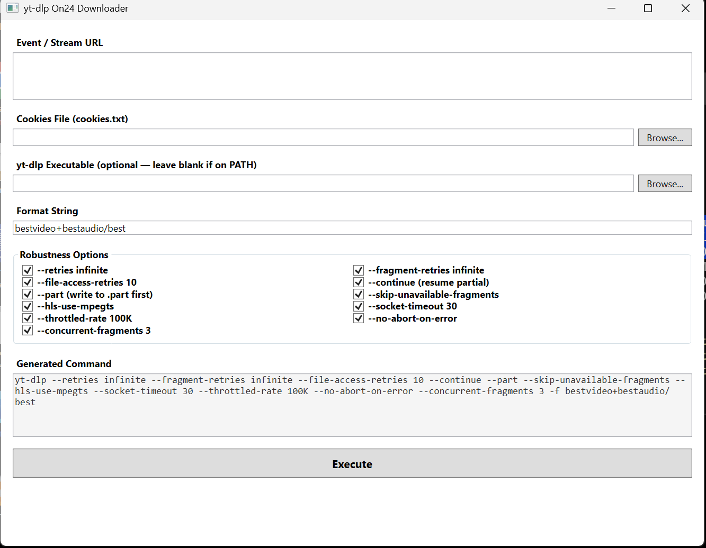

# YtdlOn24Downloader

A simple Windows WPF UI for [yt-dlp](https://github.com/yt-dlp/yt-dlp) tailored for downloading long event recordings from the **On24** platform (and any other yt-dlp-compatible stream).



---

**Table of Contents**

- [What this app does](#what-this-app-does)
- [Requirements](#requirements)
- [Quick Preview](#quick-preview)
- [Step-by-step usage guide](#step-by-step-usage-guide)
  - [Step 1 – Launch the app](#step-1--launch-the-app)
  - [Step 2 – Paste the event URL](#step-2--paste-the-event-url)
  - [Step 3 – Select your cookies file](#step-3--select-your-cookies-file)
  - [Step 4 – (Optional) Tell the app where yt-dlp lives](#step-4--optional-tell-the-app-where-yt-dlp-lives)
  - [Step 5 – Confirm the format string](#step-5--confirm-the-format-string)
  - [Step 6 – Review the robustness options](#step-6--review-the-robustness-options)
  - [Step 7 – Read the command preview](#step-7--read-the-command-preview)
  - [Step 8 – Execute](#step-8--execute)
  - [Step 9 – Come back later](#step-9--come-back-later)
- [Where downloaded files go](#where-downloaded-files-go)
- [Troubleshooting](#troubleshooting)
- [How to build (for developers)](#how-to-build-for-developers)
- [Settings Persistence](#settings-persistence)
- [License](#license)

---

## What this app does

If you currently copy-paste a giant `yt-dlp` command into Command Prompt every time you want to download an On24 event recording, this app replaces that with a simple form. You paste the URL, pick your cookies file, and press a button. It also adds a set of **reliability flags** that make 4–5 hour downloads far more stable on slow or flaky internet.

When you press **Execute**, a real CMD window opens so you can watch the download progress live. The window stays open after the download finishes so you can scroll back and read the logs.

[↑ Back to top](#ytdlon24downloader)

---

## Requirements

Before you start, make sure you have:

1. **Windows 10 or Windows 11**
2. **[.NET 10 Desktop Runtime](https://dotnet.microsoft.com/download/dotnet)**
   *(You only need the **Runtime**, not the SDK, if you are running a pre-built release.)*
3. **[yt-dlp](https://github.com/yt-dlp/yt-dlp/releases)** installed on your computer.
   - The easiest way is to download `yt-dlp.exe` and place it in a folder that is on your system `PATH` (for example `C:\Tools` or `C:\Windows\System32`).
   - If you do not want to edit your PATH, you can still browse to the `.exe` directly inside this app.

[↑ Back to top](#ytdlon24downloader)

---

## Quick Preview

| Area | What it is |
|---|---|
| **Event / Stream URL** | Paste the full On24 event link here. |
| **Cookies File** | Browse to your exported `cookies.txt`. |
| **yt-dlp Executable** | Optional — leave blank if `yt-dlp` is on your system PATH. |
| **Format String** | Defaults to `bestvideo+bestaudio/best`. Change only if you know what you are doing. |
| **Robustness Options** | 11 checkboxes pre-tuned for long, flaky downloads. |
| **Generated Command** | Live preview of the exact command that will run. |
| **Execute** | Opens a CMD window and starts `yt-dlp`. |

> **New users:** skip straight to [Step-by-step usage guide](#step-by-step-usage-guide).

[↑ Back to top](#ytdlon24downloader)

---

## Step-by-step usage guide

### Step 1 – Launch the app

Run the app either by:
- Double-clicking `YtdlOn24Downloader.exe` (if you downloaded a release), or
- Running `dotnet run --project YtdlOn24Downloader/YtdlOn24Downloader.csproj` from the source folder.

You will see a window titled **"yt-dlp On24 Downloader"**.

[↑ Back to top](#ytdlon24downloader)

### Step 2 – Paste the event URL

1. Find the event URL you normally pass to `yt-dlp`.
   It usually looks like a very long On24 link, for example:
   ```
   https://event.on24.com/eventRegistration/console/apollox/mainEvent?&eventid=5301667&sessionid=1&username=&partnerref=&format=fhvideo1&...
   ```
2. Copy the **entire** URL (including all the query parameters after `?`).
3. Paste it into the **"Event / Stream URL"** text box at the top of the app.

> **Tip:** Do not trim or edit the URL. The app passes it exactly as you paste it.

[↑ Back to top](#ytdlon24downloader)

### Step 3 – Select your cookies file

1. Click the **Browse...** button to the right of **"Cookies File (cookies.txt)"**.
2. A Windows file dialog will open.
3. Navigate to the folder where your `cookies.txt` is saved and select it.
4. The full path will appear in the text box.

> **What is `cookies.txt`?**
> This is the cookie export you use with `yt-dlp --cookies cookies.txt`. If you do not have one yet, you can export cookies from your browser using an extension such as **[Get cookies.txt LOCALLY](https://chromewebstore.google.com/detail/get-cookiestxt-locally/cclelndahbckbenkjhflpdbgdldlbecc?pli=1)** (Chrome/Edge) or **"cookies.txt"** (Firefox). Make sure the file is named `cookies.txt` or that you pick the correct `.txt` export.

[↑ Back to top](#ytdlon24downloader)

### Step 4 – (Optional) Tell the app where yt-dlp lives

- **If `yt-dlp` is on your system PATH:** leave this box empty. The app will simply run `yt-dlp` from the command line.
- **If `yt-dlp` is not on your PATH:** click the **Browse...** button next to **"yt-dlp Executable"** and select your `yt-dlp.exe`.

[↑ Back to top](#ytdlon24downloader)

### Step 5 – Confirm the format string

The **"Format String"** box defaults to:

```
bestvideo+bestaudio/best
```

This is the same as your current command. You can change it if you want a different quality or container, but most users should leave it as-is.

[↑ Back to top](#ytdlon24downloader)

### Step 6 – Review the robustness options

In the **"Robustness Options"** group you will see 11 checkboxes. **All are checked by default** because they are specifically chosen to make long downloads survive slow internet, server throttling, and transient errors.

You can uncheck any option if you do not want it for a particular download, but the recommended setup for a 4–5 hour On24 stream is to leave them all on.

| Checkbox label | What it does |
|---|---|
| `--retries infinite` | If yt-dlp hits a fatal network error, it will retry forever instead of giving up. |
| `--fragment-retries infinite` | For DASH/HLS streams, each tiny video fragment is retried forever. This is the single most important flag for long streams. |
| `--file-access-retries 10` | Retries up to 10 times if Windows locks the file for a moment (antivirus, sync tools, etc.). |
| `--continue` | If the download stops halfway (power outage, network drop), running the same command again resumes where it left off. |
| `--part` | Data is written to a temporary `.part` file while downloading. Only when the file is complete does it get renamed to the final name. This prevents half-written corrupted files. |
| `--skip-unavailable-fragments` | If one tiny segment of the stream is missing on the server, yt-dlp skips it and keeps going instead of crashing the whole job. |
| `--hls-use-mpegts` | Forces the output container to MPEG-TS for HLS streams. MPEG-TS is far more tolerant of interruption than MP4, which can become unplayable if the download is cut off. |
| `--socket-timeout 30` | Waits 30 seconds before deciding a socket is dead. On slow networks the default timeout is sometimes too aggressive. |
| `--throttled-rate 100K` | If the download speed falls below ~100 KB/s, yt-dlp assumes the server is throttling it and re-extracts the stream URL. This often bypasses server-side rate limits. |
| `--no-abort-on-error` | If one unexpected error happens, yt-dlp logs it and keeps going instead of killing the entire download. |
| `--concurrent-fragments 3` | Downloads 3 stream fragments at the same time. This improves throughput on slow links without being so aggressive that it overwhelms your bandwidth. |

[↑ Back to top](#ytdlon24downloader)

### Step 7 – Read the command preview

As you fill in the form and toggle checkboxes, the **"Generated Command"** box at the bottom updates in real time. It shows the exact command the app will run, for example:

```
yt-dlp --retries infinite --fragment-retries infinite --file-access-retries 10 --continue --part --skip-unavailable-fragments --hls-use-mpegts --socket-timeout 30 --throttled-rate 100K --no-abort-on-error --concurrent-fragments 3 --cookies "C:\Users\You\Downloads\cookies.txt" -f "bestvideo+bestaudio/best" "https://event.on24.com/..."
```

Use this preview to double-check that everything looks correct before you run it.

[↑ Back to top](#ytdlon24downloader)

### Step 8 – Execute

1. Click the large **Execute** button.
2. A new **Command Prompt (CMD) window** will pop up and immediately start running `yt-dlp`.
3. You will see the familiar yt-dlp output: download speed, fragment count, ETA, file name, etc.
4. Leave the window open until the download finishes. Because the app uses `cmd /k`, the window **stays open** after yt-dlp exits so you can scroll up and review the complete log.

> **If you see an error in the status bar** (under the Execute button) instead of a CMD window opening, read the red message. Common causes are:
> - You forgot to paste a URL.
> - The cookies file path does not exist.
> - The URL does not start with `http://` or `https://`.
> - The yt-dlp executable path you browsed to does not exist.

[↑ Back to top](#ytdlon24downloader)

### Step 9 – Come back later

The next time you open the app, all your previous values are restored automatically:
- The last URL you pasted
- The cookies and yt-dlp paths you selected
- The format string
- Which robustness checkboxes were on or off

You only have to paste a **new URL** and click **Execute** again.

[↑ Back to top](#ytdlon24downloader)

---

## Where downloaded files go

yt-dlp saves files to your **current working directory**. Because the app launches CMD in your Windows **User Profile** folder (`C:\Users\YourName`), that is where the video will appear by default.

If you want to change the download folder, you can:
1. Keep the CMD window open after the download finishes.
2. Manually move the file.
3. *(Future feature idea: an output-folder picker inside the app.)*

[↑ Back to top](#ytdlon24downloader)

---

## Troubleshooting

| Problem | Likely cause | Fix |
|---|---|---|
| "Error: URL is required." | The URL box is empty. | Paste the full event link. |
| "Error: Cookies file not found" | The path in the Cookies box does not exist. | Click Browse and re-select the file. |
| "Error: yt-dlp executable not found" | You browsed to a wrong `.exe` path. | Clear the yt-dlp box (to use PATH) or re-browse to the correct file. |
| CMD window flashes and closes instantly | yt-dlp is not on PATH and you left the yt-dlp box empty. | Browse to `yt-dlp.exe` in the app, or add its folder to your system PATH. |
| Download is extremely slow even with all flags | The server may be sending a low-bitrate stream, or your ISP is shaping traffic. | Try lowering `--concurrent-fragments` to `1` or `2`. If the stream offers multiple formats, try a lower quality in the Format String box. |
| Build fails with "user-mapped section open" | An external tool (Google Drive sync, OneDrive, antivirus) is locking the build output folder. | Build in a non-synced folder, or run `dotnet build -p:UseAppHost=false`. |
| App launches but no window appears | A `NullReferenceException` during XAML initialization (fixed in `848ce6a`). | Pull the latest code from `main`. |

[↑ Back to top](#ytdlon24downloader)

---

## How to build (for developers)

Open a terminal (PowerShell or CMD) in the folder that contains `YtdlOn24Downloader.sln` and run:

```bash
dotnet build YtdlOn24Downloader.sln
```

To create a single-file `.exe` that does not require the .NET Runtime to be installed on the target machine:

```bash
dotnet publish YtdlOn24Downloader/YtdlOn24Downloader.csproj `
  -c Release -r win-x64 `
  --self-contained true `
  -p:PublishSingleFile=true `
  -o ./publish
```

The resulting `YtdlOn24Downloader.exe` will be in the `./publish` folder.

[↑ Back to top](#ytdlon24downloader)

---

## Settings Persistence

The app saves its state automatically when you close the window. Settings are stored in your Windows local app-data folder (`%LOCALAPPDATA%`). No registry edits or external config files are required.

[↑ Back to top](#ytdlon24downloader)

---

## License

MIT — use at your own risk. Respect the terms of service of the platforms you download from.
